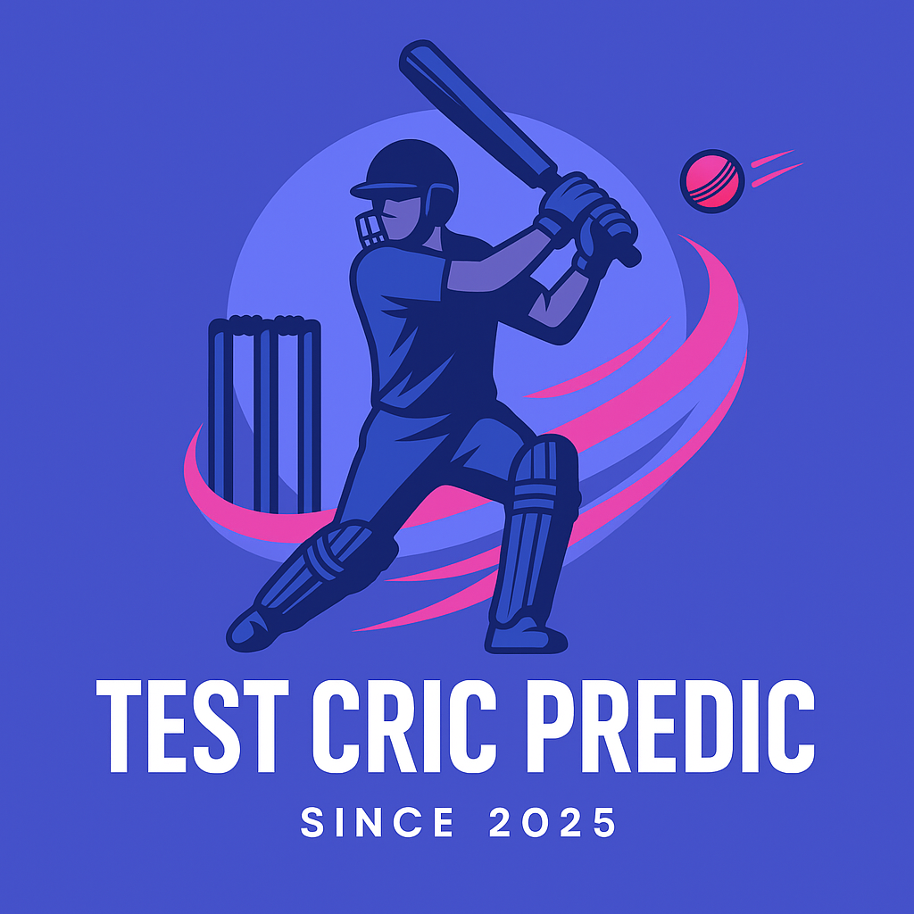

<h1 align="center">
  
</h1>

  AI/ML Student based in Dubai 🇦🇪

  Multidisciplinary builder passionate about artificial intelligence and machine learning. Always learning. 🤟🏻

## What I'm Working On

- 🎓 Learning AWS Machine Learning
- 🤖 Building AI/ML projects
- 💻 Exploring full-stack development

## Technologies & Tools

### Programming Languages

### Web Development

### Data & ML

### Cloud & DevOps

### Databases

### Tools

## 💼 Featured Projects

### [Arc Pay - AI Content Payment Agent](https://github.com/HamzaBTW/Smart-Contract-Deployment-for-Arc-AI-Agent)

Developed an AI-powered content wallet automating USDC micro-payments on Arc's Layer-1 blockchain using TypeScript and Cloudflare Workers AI.
- 🔧 **Built with:** TypeScript, Cloudflare Workers AI, OpenAI, ElevenLabs, Circle SDKs
- ⭐ **Key features:** Real-time creator payments, Sub-second finality, Personalized content recommendations
- 📅 November 2025

### AWS RAG AI Chatbot
Built a RAG chatbot using AWS Bedrock, S3, and OpenSearch with vector embeddings, enabling context-aware responses through Llama 3.3 70B integration.
- 🔧 **Built with:** AWS Bedrock, S3, OpenSearch, Llama 3.3 70B
- ⭐ **Key features:** AI knowledge base, 300-token chunking, Titan embeddings
- 📅 September 2025

### [Cricket Score Predictor](https://github.com/HamzaBTW/Cricket-Match-Predictor)

Used XGBoost, Pandas, and NumPy to predict cricket match scores with 87.3% accuracy.
- 🔧 **Built with:** Python, XGBoost, Pandas, NumPy
- ⭐ **Key features:** 87.3% accuracy, Continuous deployment workflow, SSH authentication
- 📅 August 2025

## Get In Touch

📧 [hamzasajid4815@gmail.com](mailto:hamzasajid4815@gmail.com)

💼 [LinkedIn](https://www.linkedin.com/in/hamza-sajid-5903b72a7/)

📷 [Instagram](https://www.instagram.com/hxmxabtw/)

---

*Fun fact: I can code without AI* 😄
